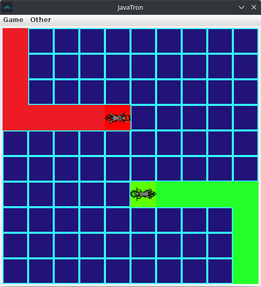

<h1>JavaTron</h1>

Based on the original GLTron.

A tile based 2D game in which 2 players are duelling with TRON cycles on a 10x10 grid. Player 1 starts from the upper left corner and uses the WASD buttons while Player 2 starts from the lower right corner and uses the arrow keys. There are 4 player colors (red, green, blue, yellow) and 10 different arena themes to choose from.

Arena themes such as:
<ul>
<li>Synthwave</li>
<li>Matrix</li>
<li>Vaporwave</li>
<li>Chessboard</li>
<li>Mario underground</li>
<li>Bedrock</li>
<li>Blurry</li>
<li>Mindfuck</li>
<li>Nicholas Cage</li>
<li>Somebody Once Told Me</li>
</ul>

The game itself looks like this:

Note: The project is represented as a NetBeans project. Works with up to version 16 of the IDE.
